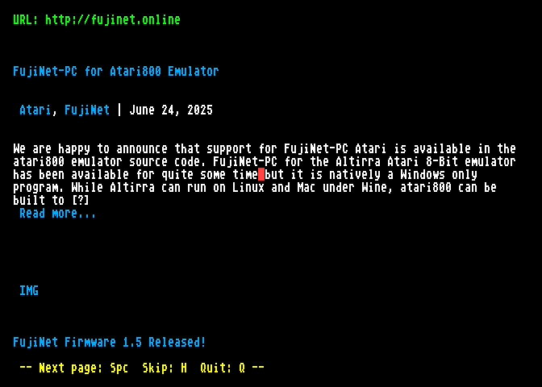
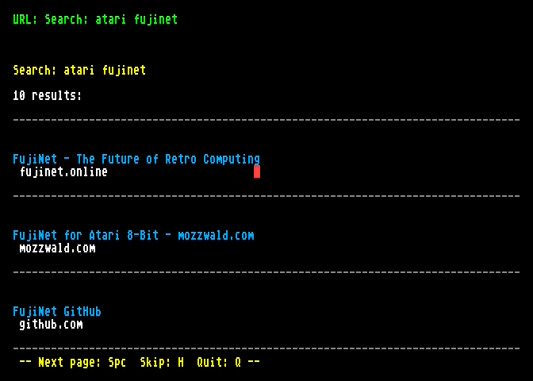

# Cactus browser for Atari XE/XL

80-column web browser for Atari 8-bit computers with VBXE, FujiNet and ST mouse.

  
  
  

## Requirements

- Atari 800XL/130XE or compatible
- [VBXE](http://lotharek.pl/productdetail.php?id=46) with FX core
- [FujiNet](https://fujinet.online/)
- ST mouse in joystick port 2 (optional, keyboard works too)

## Download & run

Get `cactus.atr` or `cactus.xex` from [Releases](https://github.com/viktorcech/cactus-browser/releases) or [`bin/`](bin/).

- **Real hardware:** SpartaDOS X is recommended (hi-SIO makes downloads faster), then run `cactus.xex`
- **Altirra:** add VBXE, disable BASIC, boot `cactus.xex` or `cactus.atr`

## Controls

| Key | Action |
|-----|--------|
| Mouse click / TAB + Return | Follow link |
| Space / Return | Next page |
| U | Enter URL or search (no dot = web search) |
| B | Back |
| Ctrl+B | Bookmarks |
| Ctrl+F / F | Find in page |
| H | Skip to next heading |
| P | Proxy on/off |
| I | Help |
| Q | Quit / stop loading |

## Building

Requires [MADS](https://github.com/tebe6502/Mad-Assembler): `./build.sh` → `bin/cactus.xex`

## License

MIT
